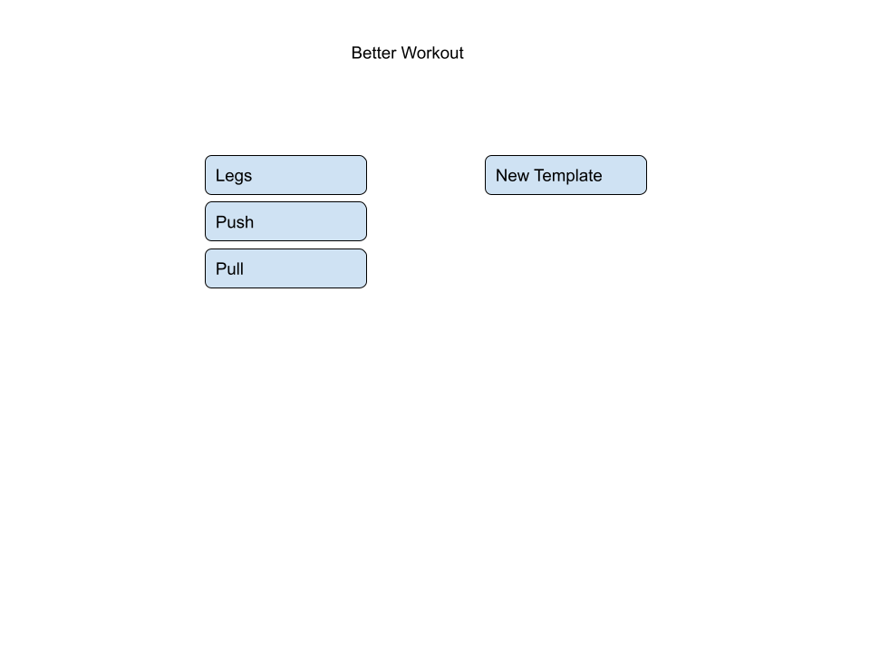
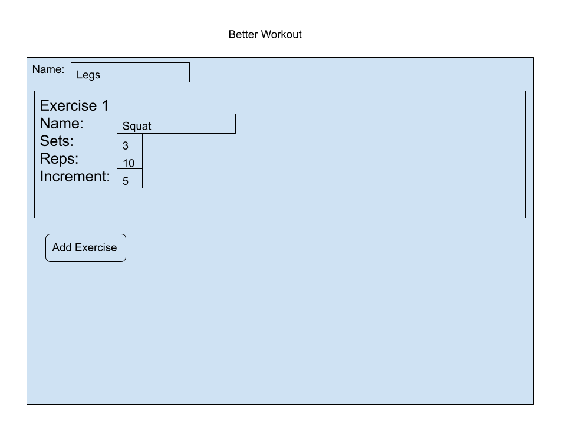
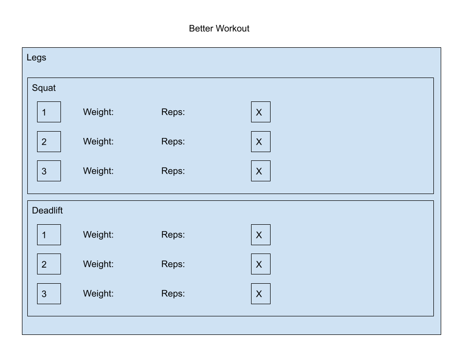

The content below is an example project proposal / requirements document. Replace the text below the lines marked "**TODO**" with details specific to your project. Remove the "TODO" lines.

(**TODO**: your project name\_)

# Better Workout

## Overview

Tracking your workouts with an excel sheet can get quite frustraiting. Most workout apps only allow you to log your workout but dont allow you to plan ahead.

Better workout allows you to create workout routines and automatically increments weights for you so you dont have to. That way you spend more time working out and less time thinking.

## Data Model

(**TODO**: a description of your application's data and their relationships to each other\_)

The application will store Users, Templates, Workouts, Exercises, and sets

- users can have multiple Workouts and Templates (via references)
- every time a user starts a workout from a template, a new workout object is created
- each Workout can have multiple exercises (by embedding)
- each exercise in a workout contains multiple sets
- each set has a number of reps and a checked boolean field
- each Template contains multiple exercises
- each exercise in a template contains sets, reps, and increment(holds the amount of weight increase between workouts)

(**TODO**: sample documents\_)

An Example User:

```javascript
{
  username: "johndoe",
  hash: // a password hash,
  Workouts: // an array of references to Workout documents
  Templates: // an array of references to workout templates
}
```

An Example Template with Embedded Exercises:

```javascript
{
  user: // a reference to a User object
  name: "Legs",
  exercises: [
    { name: "Squat", Sets: "3",reps: "10", increment: "5"},
    { name: "Deadlift", Sets: "2",reps: "5", increment: "10"},
  ],
  CreatedAt: // timestamp
}
```

An Example Workout with Embedded Exercises and sets based on the above template(user completed 2 sets of squats):

```javascript
{
  user: // a reference to a User object
  templateName: "Legs",
  exercises: [
    { name: "Squat", Sets: [
      {reps: "10", weight:"200", checked: true},
      {reps: "10", weight:"200", checked: true},
      {reps: "10",weight:"200", checked: false}
    ]},
    { name: "Deadlift", Sets: [
      {reps: "5", weight:"300", checked: false},
      {reps: "5", weight:"300", checked: false},
    ]},
  ],
  completed: false //will be true if workout is finished
  CompletedAt: // timestamp
}
```

## [Link to Commented First Draft Schema](db.js)

## Wireframes

(**TODO**: wireframes for all of the pages on your site; they can be as simple as photos of drawings or you can use a tool like Balsamiq, Omnigraffle, etc.\_)

/home - page for creating a new shopping list


/templates - page for showing all templates



/templatecreator - page for creating a new template



/templateSelector - page for starting a workout from a template


/workout - page for tracking workout



## Site map

Here's the [Site Map](https://embed.creately.com/pc3pb9fYLMP?token=V9uj7kCB8HFmObUv&type=svg)

## User Stories or Use Cases

1. as non-registered user, I can register a new account with the site
2. as a user, I can log in to the site
3. as a user, I can create a new template
4. as a user, I can view all of the templates I made and edit them
5. as a user, I can add start a workout from a template
6. as a user, I can mark exercises as complete

## Research Topics

- (5 points) Integrate user authentication
  - I'm going to be using passport for user authentication
  - And account has been made for testing; I'll email you the password
- (3 points) Write unit tests in mocha

8 points total out of 8 required points

## [Link to Initial Main Project File](app.js)

## Annotations / References Used

(**TODO**: list any tutorials/references/etc. that you've based your code off of\_)

1. [passport.js authentication docs](http://passportjs.org/docs) - (add link to source code that was based on this)
